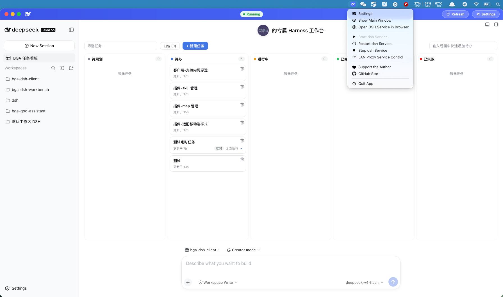
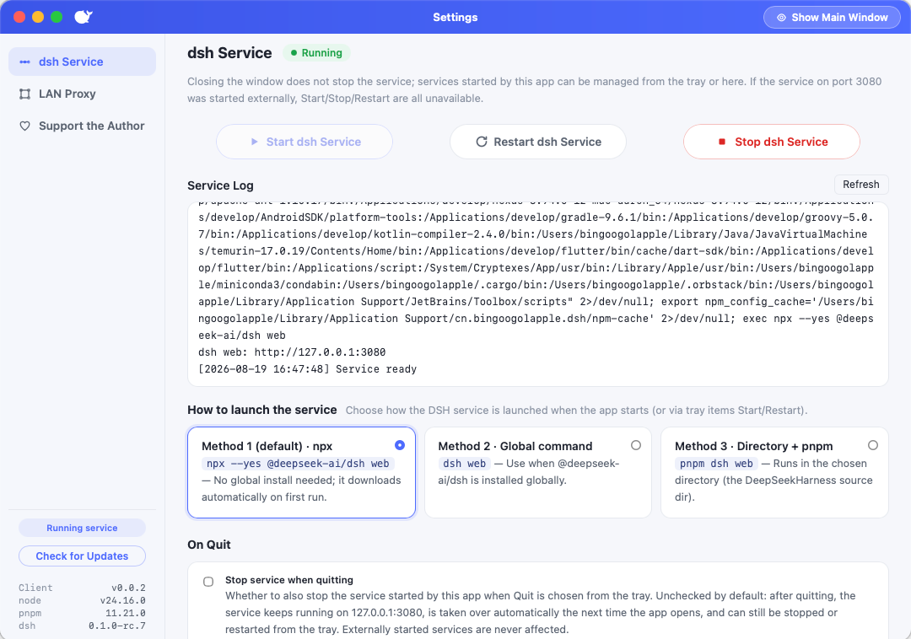
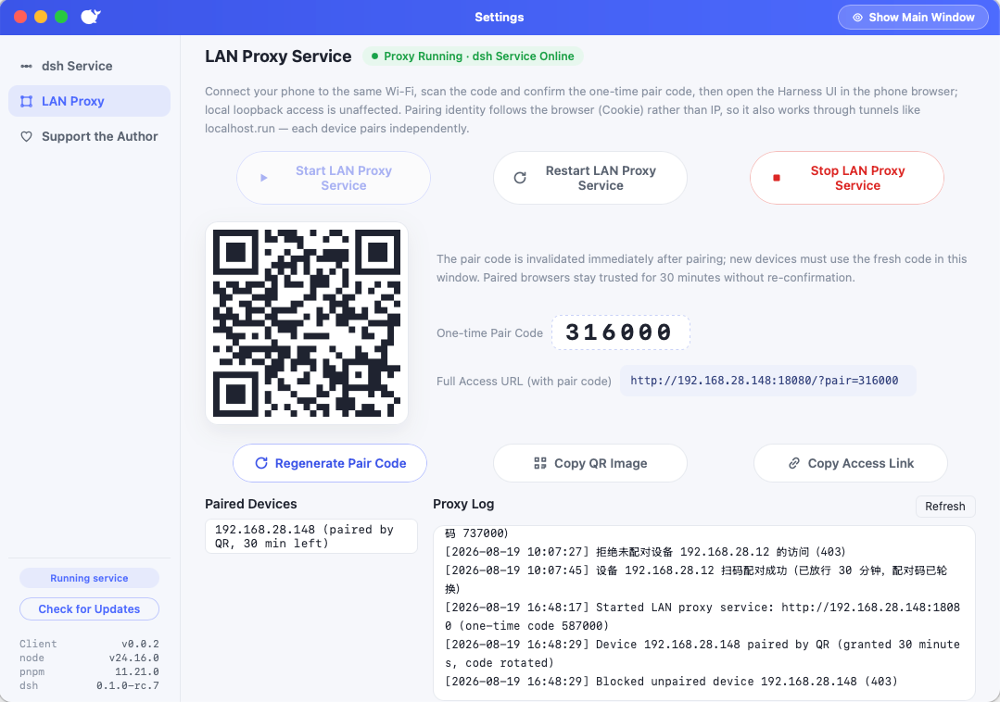

# DeepSeek Harness Client

[](../../releases/latest)
[](../../actions/workflows/release.yml)
[](LICENSE)
[](../../releases/latest)
[](https://www.apple.com/macos)

**🌐 [中文文档](README.zh-CN.md)**

A desktop shell that wraps the [DeepSeek Harness](https://github.com/deepseek-ai/deepseek-harness) web management UI into a desktop app — built with [Tauri](https://tauri.app), featuring automatic service detection/launching, a persistent system tray, and LAN QR-code pairing with public-tunnel access.





## Features

### ⚙️ Service Management

- **Start / Restart / Stop** the service from the main window footer, the settings window, or the tray menu; buttons are dynamically disabled by state (running → "Start" disabled, stopped → "Stop/Restart" disabled, starting or externally-owned → all three disabled).
- **Four launch methods** (switchable in settings and remembered):
  1. `npx --yes @deepseek-ai/dsh web` (default)
  2. `dsh web` (globally installed)
  3. `pnpm dsh web` from a custom directory
  4. **Bundled Node.js** (`-bundled` builds only: the app ships its own runtime and works fully offline; bundled builds force this method and hide the method selector in settings)
- **Auto-detect + auto take over**: on startup it probes port 3080 — an externally running service is reused as-is (not taken over; Stop/Restart disabled); a service launched by this app, or released at last quit, is automatically taken over and can still be stopped/restarted.
- Service logs stream live into `service.log` under the system app_config directory; files rotate automatically at 5 MB (two old archives kept). npx uses a **dedicated cache directory** (never touches the user's `~/.npm`, avoiding permission/corrupt-cache issues).
- The status badge in the top bar and settings window updates in real time: stopped / starting / running / failed.

### 🗂️ System Tray

- Persistent tray menu: **Client Settings / Show Main Window / Open dsh Service Page in Browser / Start Service / Restart Service / Stop Service / LAN Proxy Service Control / Support the Author / GitHub Star / Quit**.
- Every item has a semantic monochrome icon; service items are dynamically disabled by service state (same rules as the settings window); clicking Start/Restart/Stop immediately opens the settings window on the "DSH Service Control" panel so you can watch the operation and logs; "LAN Proxy Service Control" and "Support the Author" switch to their panels, and "GitHub Star" opens the repo homepage in your browser.
- Closing the window only hides it — bring it back anytime from the tray; single-instance, launching again just focuses the main window.

### 🔧 Behavior Settings

- **"Stop service on quit" toggle**: on (default) = quitting from the tray stops the service this app launched; off = the service is released and keeps running on 3080 in the background, then auto-taken-over on next launch.
- An externally started service is never stopped by this app (only reused).
- Settings persist to `~/.dsh/bga-dsh-client/settings.json`.

### 🔄 Update Checks

- Checks GitHub Releases for the latest version once 5 seconds after startup (automatic checks are at least 24 h apart, no spamming), and shows a "New version available" hint in the settings version area when one is found.
- The version area on the left of the settings window shows the versions of node / pnpm / dsh: when the service is online it prefers the **real versions reported by the running service** (works even when launched via npx), otherwise it shows the bundled runtime versions (bundled build) or the system PATH versions (plain build). A "**Check for updates**" button allows manual checks anytime; results are shown live: new version found / already up to date / check failed.
- When a new version is found you can "**Go to Download**" directly (opens the Releases page in your system browser); clicking "**Ignore**" suppresses the hint until a newer version is released.
- Check results are cached to `~/.dsh/bga-dsh-client/update-cache.json`; network failures or GitHub API rate limits degrade silently without affecting normal use.
- Maintainers need no extra release steps: keep using the existing tag-based release flow, the app reads the latest Release automatically.

### 🎫 LAN Access (QR-Code Pairing)

- The service still listens only on `127.0.0.1:3080` (direct localhost access is unaffected); a separate "pairing gate + reverse proxy" is started, probing free ports starting at `0.0.0.0:18080` (18080~18110).
- Open "LAN Access" in settings to show the pairing window: LAN address, 6-digit one-time pairing code, and QR code, with one-click **copy link / copy QR as PNG**.
- After scanning the QR from a phone on the same Wi-Fi (the QR embeds the pairing code), that **browser session** is allowed for **30 minutes**, after which the phone can open the Harness UI directly; the proxy rewrites both Host and Origin to loopback, naturally passing Harness's trusted-hosts check.
- **Public tunnels are supported as well** (e.g. `ssh -R 80:localhost:<gateway port> nokey@localhost.run`): tunnel traffic also goes through the pairing gate — **every request (including loopback sources) must be paired first**, so nobody can reach the service without a pairing code; LAN and tunnel sessions pair independently.
- Pairing identity follows a **browser session token (Cookie)**, not the device IP: a successful pairing issues a `dsh_pair` Cookie, subsequent requests pass through with it, and pairing one device never grants access to other devices at any time.
- The pairing code is **truly one-time**: any successful pairing invalidates it immediately and issues a new one (each code can pair at most one device); already-paired devices are unaffected, new devices must scan the fresh code in the window; you can "regenerate the pairing code" and clear all paired sessions anytime.
- The pairing window shows the live **paired-sessions list** (source IP + minutes remaining; tunnel sessions all show `127.0.0.1`) and the pairing log (`pairing.log`, also rotating at 5 MB); unpaired requests get **403**, and **503** is returned when the local service is not running.

### 🌐 Localization (中文 / English)

- The client UI follows the **DeepSeek Harness language setting**: it reads `locale.preference` from `$DSH_HOME/settings.yaml` (default `~/.dsh/settings.yaml`; `.yml` / `.json` are also supported). `zh` (incl. `zh-CN` / `zh_Hans`) → Chinese, `en` (incl. `en-US`) → English, anything else falls back to Chinese.
- Coverage: tray menu, phone-facing pairing pages, settings window, main-window splash screen, status badges and log hints — the full UI. Dynamic copy like service details also re-renders on language switch (already-rendered history keeps the previous language until the next status event).
- Editing the Harness config file (e.g. changing `locale.preference: en`) while the app runs needs no restart: the client watches the config every 2 seconds and switches the UI language immediately.

### 🔒 Privacy & Telemetry

- The client integrates [Sentry](https://sentry.io) for crash monitoring and anonymous behavior statistics. Uploads are limited to **behavior events** (app start, service start/stop, pairing toggle, settings saved, update-check result, settings window opened, etc.) — see [docs/Sentry.md](docs/Sentry.md) for details.
- The device identifier is an **anonymous machine ID** (an irreversible hash of hostname and MAC address, UUID format) that contains no personally identifiable information.
- **No performance tracing** (`traces_sample_rate = 0`) and **no business content** (file contents, chat logs, API keys, etc.) is ever uploaded.
- Uploads run asynchronously on a background thread and fail silently — they never affect normal use.

## For Users

If you just want to use this desktop client, follow the steps below — **no Node.js, pnpm or dsh installation, and no commands needed** — download and install, then go.

### Installation

1. Open the [Releases](../../releases/latest) page of this repo and download the installer matching your OS from the latest release's assets:
   - **macOS**: `.dmg` file — open it and drag the app into "Applications".
   - **Windows**: `.exe` installer (NSIS) — double-click to run.
   - **Linux**: `.deb` package — install with `dpkg -i`.

   > 💡 **Want the easiest path? Prefer installers with the `-bundled` suffix** (e.g. `DeepSeekHarness-bundled-macos-aarch64.dmg`). They **bundle Node.js / npx / dsh and work fully offline** — double-click and go, no dev environment needed on your machine; the plain build (no `-bundled` suffix) requires Node.js / npx / dsh installed on your system to launch the service.
2. Launch DeepSeekHarness — the app automatically detects whether a DSH service is already running; if not, it launches one using the method configured in settings.

> **macOS "can't open" troubleshooting** (this project is not developer-signed or notarized, so Gatekeeper blocking is expected):
>
> 1. **"cannot be opened because the developer cannot be verified"**: right-click the app → Open; or "System Settings → Privacy & Security → Open Anyway". One-time approval is enough.
> 2. **"DeepSeekHarness is damaged and can't be opened. You should move it to the Trash"**: this message is misleading — **the file is usually not damaged**; it's the "downloaded quarantine flag + unsigned/unnotarized" being misjudged by Gatekeeper. Fix: first confirm the downloaded version matches your Mac's architecture (an Intel Mac installing the aarch64 build reports the same error), then drag the app into "Applications" and run in Terminal:
>
>    ```bash
>    xattr -dr com.apple.quarantine /Applications/DeepSeekHarness.app
>    ```
>
>    Then double-click normally. This command only removes the "downloaded from the internet" quarantine flag and makes no other changes.

### Usage

1. After launching, the main window shows the DSH Web GUI — identical to visiting `http://127.0.0.1:3080` in a browser.
2. Closing the window does not quit the app; it hides to the system tray and can be brought back anytime.
3. To allow other devices on your LAN, open "LAN Access" in settings and pair with the phone by scanning the QR code.

## For Maintainers

If you are a repo maintainer or want to modify and rebuild from source, read on.

### Project Structure

```
bga-dsh-client/
├── .github/workflows/
│   └── release.yml               # auto-build & publish to GitHub Releases on tag push
├── assets/
│   ├── icon-source.svg           # app icon source (SVG)
│   ├── icon-1024.png             # app icon (1024×1024 PNG)
│   └── menu-icons/               # tray menu icons (SVG sources)
├── images/                       # README screenshots (zh & en sets)
│   ├── main-window-zh.png / main-window-en.png   # main window
│   ├── dsh-server-zh.png / dsh-server-en.png     # DSH service control
│   └── lan-proxy-zh.png / lan-proxy-en.png       # LAN proxy service control
├── scripts/
│   ├── build-release.sh          # release build script (bundled / two modes)
│   ├── bundle-runtime.mjs        # runtime bundling logic
│   ├── set-app-version.sh        # batch set the app version
│   └── set-runtime-version.sh    # batch set the runtime versions
├── docs/
│   ├── Sentry.md                 # telemetry behavior & privacy statement
│   └── RUNTIME-VERSIONING.md     # bundled runtime versioning conventions
├── src-tauri/                    # Rust backend (Tauri core)
│   ├── Cargo.toml                # Rust dependencies
│   ├── Cargo.lock                # Rust dependency lock
│   ├── tauri.conf.json           # Tauri app config (window, bundling, security, etc.)
│   ├── capabilities/             # Tauri permission declarations
│   ├── icons/                    # packaging icons of all sizes + menu/ (tray PNG icons)
│   ├── resources/                # runtime resources (bundled Node.js etc., bundled builds only)
│   └── src/                      # Rust sources
│       ├── main.rs               # app entry: window/tray/service/pairing/update orchestration
│       ├── service.rs            # DSH service management: detect, launch, stop, logs
│       ├── settings.rs           # settings parsing & persistence
│       ├── tray.rs               # system tray
│       ├── update.rs             # app update checks
│       ├── telemetry.rs          # Sentry telemetry (anonymous behavior events)
│       ├── i18n.rs               # localization (follows Harness language config)
│       └── pairing/              # LAN pairing gateway (mod/forward/rewrite/tunnel)
├── ui/                           # frontend (plain static HTML/CSS/JS, no build step)
│   ├── index.html                # main window
│   ├── settings.html             # settings window
│   └── assets/                   # app.js / settings.js / splash.js / i18n.js / app.css
├── dist/release/                 # build artifact output
├── package.json                  # Node.js deps (@tauri-apps/cli)
├── pnpm-lock.yaml                # pnpm dependency lock
├── rust-toolchain.toml           # pinned Rust toolchain
├── LICENSE                       # MIT License
└── README.md
```

### Building from Source

Prerequisites: macOS / Windows / Linux, Rust (managed automatically via `rust-toolchain.toml`), Node.js (with pnpm).

```bash
pnpm install          # install @tauri-apps/cli and other deps
pnpm dev              # dev mode: ui/ is plain static frontend, changes apply instantly; Rust changes hot-recompile & restart
cargo test            # Rust unit tests (settings parsing/persistence, i18n, pairing proxy rewriting, etc.)
pnpm build            # release build (plain), artifacts under src-tauri/target/release/bundle/
pnpm bundled          # bundled build: ships Node.js + dsh runtime, offline-capable, artifacts named with -bundled suffix
pnpm two              # build both at once: plain + bundled, artifacts under dist/release/
```

> Note: `pnpm dev` holds a single-instance lock (socket); starting a release build then makes it hand over and exit automatically (by design). The dev environment needs a DSH service already running or launchable on port 3080.

The three release build modes:

| Mode | Command | Runtime dependency | Artifacts |
| --- | --- | --- | --- |
| **plain** (default) | `pnpm build` | relies on system-installed Node.js / npx / dsh | small, users need to prepare a DSH environment |
| **bundled** | `pnpm bundled` | bundles Node.js + pnpm + dsh, offline-capable | large, works out of the box, name carries `-bundled` suffix |
| **two** | `pnpm two` | produces plain + bundled at once | one build yields both versions for easy distribution |

### Releasing

Releases go through GitHub Releases, flow:

1. **Set the app version** (required before tagging): run `set-app-version.sh` to update the version in `package.json`, `src-tauri/Cargo.toml`, and `src-tauri/tauri.conf.json` consistently so it matches the tag (`release.yml` validates this).

   ```bash
   ./scripts/set-app-version.sh 0.2.0        # bump the client app version
   ./scripts/set-app-version.sh 0.2.0-beta.1 # pre-release formats also work
   ```

2. **Bump the bundled runtime versions** (optional): to update the Node.js / pnpm / dsh versions shipped in the bundled build, run `set-runtime-version.sh`. It updates `bundle-runtime.mjs` (the single source of truth) and `RUNTIME-VERSIONING.md` in sync, and rebuilds the runtime to verify.

   ```bash
   ./scripts/set-runtime-version.sh                     # interactive: pick component → pick/enter version
   ./scripts/set-runtime-version.sh node v24.11.0       # specify the node version directly
   ./scripts/set-runtime-version.sh pnpm 10.1.0 dsh 0.2.0  # bump multiple components at once
   ./scripts/set-runtime-version.sh dsh 0.2.0 --no-rebuild  # only update files, skip runtime rebuild
   ./scripts/set-runtime-version.sh node v24.11.0 --dry-run  # preview only, no changes
   ```

3. Run `pnpm two` locally to confirm the build works (optional, for self-testing).
4. Tag and push, e.g.:

   ```bash
   git tag v0.0.2
   git push origin v0.0.2
   ```

5. After pushing, `.github/workflows/release.yml` automatically builds on a macOS runner and uploads the resulting `.dmg`, `.app`, etc. to the Release of that tag.

Users always download the latest version from the [Releases](../../releases/latest) page.

## Support the Author

* The author's primary coding plan is [OpenCode Go](https://opencode.ai/go?ref=8CYK5082AG), a cloud subscription (OpenCode Go) built on the open-source [opencode.ai](https://opencode.ai/go?ref=8CYK5082AG). Subscribing [OpenCode Go via the author's referral link](https://opencode.ai/go?ref=8CYK5082AG) gives **you and the author $5 credit each** — feel free to support the author through this link, thank you!

OpenCode Go's usage limits (cheap models leave little to worry about for tokens):

- 5-hour limit — $12 usage credit
- Weekly limit — $30 usage credit
- Monthly limit — $60 usage credit

## Other Projects by the Author

* Check out the author's first indie software product, the [God Assistant browser extension/plugin development platform](https://github.com/bingoogolapple/bga-god-assistant-config).
* You are also welcome to check out the author's other DeepSeek Harness plugin, the [DSH Workbench Plugin (bga-dsh-workbench)](https://github.com/bingoogolapple/bga-dsh-workbench): it shows a personalized banner with avatar at the hero empty state, plays confetti on turn completion, and ships a built-in task board that drives agent sessions with 5-field cron scheduling.

## License

This project is open-sourced under the [MIT License](LICENSE) — free to use, modify, and distribute.
