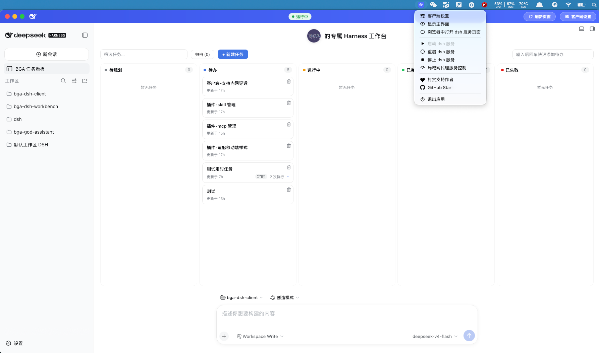
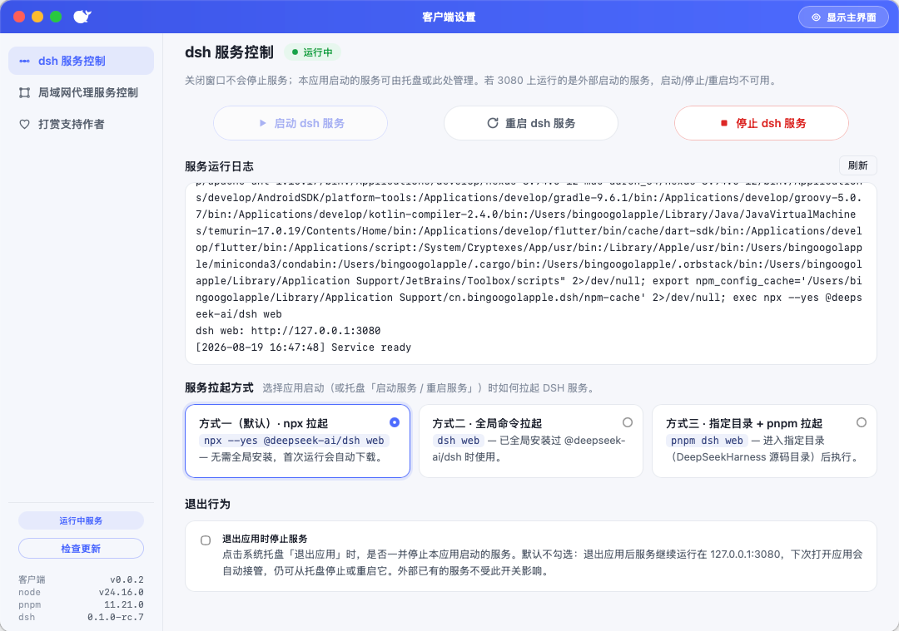
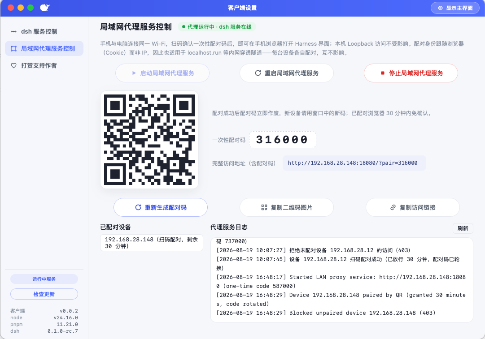

# DeepSeek Harness 客户端

[](../../releases/latest)
[](../../actions/workflows/release.yml)
[](LICENSE)
[](../../releases/latest)
[](https://www.apple.com/macos)

**🌐 [English Documentation](README.md)**

一个把 [DeepSeek Harness](https://github.com/deepseek-ai/deepseek-harness) 的 Web 管理界面包装成桌面应用的桌面壳——基于 [Tauri](https://tauri.app) 构建，自动探测/拉起服务、常驻系统托盘、支持局域网扫码与内网穿透隧道配对访问。





## 功能介绍

### ⚙️ 服务管理

- **启动 / 重启 / 停止**服务：可分别从主界面底部、设置页、托盘菜单操作；操作按钮按状态动态禁用（运行中禁「启动」，未运行禁「停止/重启」，启动中或外部服务时三个全禁）。
- **四种拉起方式**（设置页切换并记忆）：
  1. `npx --yes @deepseek-ai/dsh web`（默认）
  2. `dsh web`（全局已安装）
  3. 指定目录 `pnpm dsh web`
  4. **内置 Node.js**（仅 `-bundled` 版提供：应用自带运行时，完全离线可用；内置版强制使用该方式，设置页自动隐藏拉起方式选择）
- **自动探测 + 自动接管**：启动时探测 3080 端口——外部已有服务直接复用（不接管，停止/重启禁用）；本应用启动、上次退出放生的服务则自动接管，仍可停止/重启。
- 服务日志实时滚动展示，写入系统 app_config 目录的 `service.log`；超过 5MB 自动轮转（保留两份旧档）。npx 使用**独立缓存目录**（不读写用户 `~/.npm`，绕开权限/缓存损坏问题）。
- 顶栏与设置页的状态徽标实时显示：未运行 / 启动中 / 运行中 / 失败。

### 🗂️ 系统托盘

- 常驻托盘菜单：**客户端设置 / 显示主界面 / 浏览器中打开 dsh 服务页面 / 启动服务 / 重启服务 / 停止服务 / 局域网代理服务控制 / 打赏支持作者 / GitHub Star / 退出应用**。
- 每项带语义单色图标；服务类菜单项随服务状态动态禁用（与设置页同一套规则）；点击「启动/重启/停止」会立即打开设置窗口并切到「dsh 服务控制」面板，直接看到操作过程与日志；「局域网代理服务控制」「打赏支持作者」分别切到对应面板，「GitHub Star」在浏览器打开仓库主页。
- 关闭窗口只是隐藏，随时可从托盘唤回；单实例运行，重复启动只聚焦主窗口。

### 🔧 行为设置

- **「退出应用时停止服务」开关**：勾选（默认）= 托盘「退出应用」时一并停止本应用启动的服务；取消 = 服务放生、继续在 3080 后台运行，下次启动自动接管。
- 外部启动的服务永远不会被本应用停止（只复用）。
- 配置持久化到 `~/.dsh/bga-dsh-client/settings.json`。

### 🔄 应用更新检测

- 启动 5 秒后自动检查一次 GitHub Releases 最新版本（两次自动检查间隔 ≥ 24 小时，不频繁请求），发现新版本时设置页版本区显示「发现新版本」提示。
- 设置页左侧版本区同时展示 node / pnpm / dsh 三个工具的版本信息：服务在线时优先显示**运行中服务自报的真实版本**（npx 拉起的也能拿到），否则显示内置 runtime（bundled 版）或系统 PATH（plain 版）的版本；并提供「**检查更新**」按钮，可随时手动检查；检查结果实时显示：发现新版本 / 已是最新版本 / 检查失败。
- 发现新版本时可直接「**前往下载**」（系统浏览器打开 Releases 页面）；点「**忽略**」后不再提示，直到发布更新的版本。
- 检查结果缓存到 `~/.dsh/bga-dsh-client/update-cache.json`；网络不可用或 GitHub API 限流时静默降级，不影响正常使用。
- 维护者无需额外发版步骤：沿用现有 tag 发布流程，应用自动读取最新 Release。

### 🎫 局域网访问（扫码配对）

- 服务继续只监听本机 `127.0.0.1:3080`（本机 Loopback 直接访问不受影响），另起「配对门禁 + 反向代理」，从 `0.0.0.0:18080` 起自动尝试空闲端口（18080~18110）。
- 设置页「局域网访问」打开配对窗口：展示局域网地址、6 位一次性配对码与二维码，可一键**复制链接 / 复制二维码 PNG**。
- 手机与电脑连同一 Wi-Fi 后扫码（QR 内含配对码），该**浏览器会话**放行 **30 分钟**，之后在手机浏览器直接打开 Harness 界面；代理把 Host 与 Origin 一并改写为 loopback，天然通过 Harness 的 trusted-hosts 校验。
- **同时支持内网穿透隧道**（如 `ssh -R 80:localhost:<网关端口> nokey@localhost.run`）：隧道流量同样走配对门禁——**所有访问（包括 loopback 来源）都必须先配对**，杜绝「拿不到配对码也能访问」；局域网与隧道各自配对、互不影响。
- 配对身份跟随 **浏览器会话令牌（Cookie）** 而非设备 IP：配对成功即签发 `dsh_pair` Cookie，后续请求凭 Cookie 通过门禁，且任意时刻「一台设备配对」都不会放行其他设备。
- 配对码为**真·一次性**：任一设备配对成功即立即作废并换新码（同一码最多只能成功配对一台设备），已配对设备不受影响，新设备需扫窗口内新码；可随时「重新生成配对码」并清空已配对会话。
- 配对窗口实时展示**已配对会话列表**（来源 IP + 剩余分钟，隧道访问统一显示 `127.0.0.1`）与配对日志（`pairing.log`，同样 5MB 轮转）；未配对访问返回 **403**，本机服务未启动时返回 **503**。

### 🌐 多语言（中文 / English）

- 客户端界面跟随 **DeepSeek Harness 的语言配置**：读取 `$DSH_HOME/settings.yaml`（默认 `~/.dsh/settings.yaml`，也支持 `.yml` / `.json`）的 `locale.preference`，`zh`（含 `zh-CN` / `zh_Hans`）显示中文、`en`（含 `en-US`）显示英文，其他取值回落中文。
- 覆盖范围：托盘菜单、配对页面（手机浏览器端错误页）、设置窗口、主界面启动页、状态徽标与日志提示等全部文案；服务详情等动态文案也会随语言切换实时刷新（已生成的历史详情保持上次语言，等下一次状态事件更新）。
- 运行中修改 Harness 配置文件（如改 `locale.preference: en`）无需重启：桌面客户端每 2 秒检测一次配置变更，检测到后立即切换界面语言。

### 🔒 隐私与遥测

- 客户端集成 [Sentry](https://sentry.io) 用于崩溃监控与匿名行为统计，上报内容仅限**行为事件**（应用启动、服务启动/停止、配对开关、设置保存、更新检查结果、设置页打开等），详见 [docs/Sentry.md](docs/Sentry.md)。
- 设备标识为**匿名机器 ID**（基于主机名与 MAC 地址的不可逆哈希，UUID 格式），不含任何可识别的个人信息。
- **不采集性能追踪**（`traces_sample_rate = 0`），也**不上报任何业务内容**（文件内容、聊天记录、API Key 等）。
- 上报在后台线程异步执行、失败静默忽略，不影响正常使用。

## 软件使用者

如果你只是想用这个桌面客户端，按下面步骤即可，**无需安装 Node.js、pnpm 或 dsh，也不用敲任何命令**——下载安装即可直接上手。

### 安装

1. 打开本仓库的 [Releases](../../releases/latest) 页面，在最新版本的 Assets 中下载对应你操作系统的安装包：
   - **macOS**：`.dmg` 文件，打开后拖入「应用程序」目录。
   - **Windows**：`.exe` 安装程序（NSIS），双击运行即可。
   - **Linux**：`.deb` 包，使用 `dpkg -i` 安装。

   > 💡 **想最省事？优先下载文件名带 `-bundled` 后缀的安装包**（如 `DeepSeekHarness-bundled-macos-aarch64.dmg`）。它会**内置 Node.js / npx / dsh 运行时，完全离线可用**，双击即用，不需要你在本机准备任何开发环境；普通版（文件名不带 `-bundled`）则需要系统已装好 Node.js / npx / dsh 才能拉起服务。
2. 启动 DeepSeekHarness，应用会自动探测本机是否已有 DSH 服务运行；如果没有则按设置页配置的方式自动拉起。

> **macOS 打开报错处理**（本项目未做开发者签名与公证，被 Gatekeeper 拦截属正常现象）：
>
> 1. **提示「无法打开，因为无法验证开发者」**：右键 app → 打开；或「系统设置 → 隐私与安全性 → 仍要打开」。放行一次后即可正常使用。
> 2. **提示「”DeepSeekHarness”已损坏，无法打开。你应该将它移到废纸篓」**：这个提示有误导性，**文件通常没有损坏**，是「下载隔离标记 + 未签名/未公证」被 Gatekeeper 误判所致。处理方式：先确认下载的版本与你的 Mac 架构匹配（Intel Mac 装 aarch64 版会报同样的错误），再把 app 拖入「应用程序」，打开「终端」执行：
>
>    ```bash
>    xattr -dr com.apple.quarantine /Applications/DeepSeekHarness.app
>    ```
>
>    然后正常双击即可打开。该命令仅移除「从网上下载」的隔离标记，不做任何其他修改。

### 使用

1. 启动应用后，主界面会显示 DSH Web GUI，与浏览器访问 `http://127.0.0.1:3080` 完全一致。
2. 关闭窗口不会退出应用，而是隐藏到系统托盘，可随时从托盘唤回。
3. 如需局域网内其他设备访问，可在设置页打开「局域网访问」，用手机扫码配对。

## 软件维护者

如果你是仓库维护者或想基于源码自行修改、重新构建，请往下看。

### 目录结构

```
bga-dsh-client/
├── .github/workflows/
│   └── release.yml               # 推送 tag 时自动构建并发布到 GitHub Releases
├── assets/
│   ├── icon-source.svg           # 应用图标源文件（SVG）
│   ├── icon-1024.png             # 应用图标（1024×1024 PNG）
│   └── menu-icons/               # 托盘菜单图标（SVG 源）
├── images/                       # README 截图素材（中文/英文各一组）
│   ├── main-window-zh.png / main-window-en.png   # 主界面
│   ├── dsh-server-zh.png / dsh-server-en.png     # dsh 服务控制
│   └── lan-proxy-zh.png / lan-proxy-en.png       # 局域网代理服务控制
├── scripts/
│   ├── build-release.sh          # 发布构建脚本（bundled / two 模式）
│   ├── bundle-runtime.mjs        # 运行时打包逻辑
│   ├── set-app-version.sh        # 批量设置应用版本号
│   └── set-runtime-version.sh    # 批量设置运行时版本号
├── docs/
│   ├── Sentry.md                 # 遥测行为与隐私说明
│   └── RUNTIME-VERSIONING.md     # 内置运行时版本管理约定
├── src-tauri/                    # Rust 后端（Tauri 核心）
│   ├── Cargo.toml                # Rust 依赖声明
│   ├── Cargo.lock                # Rust 依赖锁定
│   ├── tauri.conf.json           # Tauri 应用配置（窗口、打包、安全策略等）
│   ├── capabilities/             # Tauri 权限声明
│   ├── icons/                    # 各尺寸打包图标 + menu/（托盘菜单 PNG 图标）
│   ├── resources/                # 运行时资源（内置 Node.js 等，仅 bundled 版）
│   └── src/                      # Rust 源码
│       ├── main.rs               # 应用入口：窗口/托盘/服务/配对/更新编排
│       ├── service.rs            # DSH 服务管理：探测、拉起、停止、日志
│       ├── settings.rs           # 设置解析与持久化
│       ├── tray.rs               # 系统托盘
│       ├── update.rs             # 应用更新检测
│       ├── telemetry.rs          # Sentry 遥测（匿名行为事件）
│       ├── i18n.rs               # 多语言（跟随 Harness 语言配置）
│       └── pairing/              # 局域网配对网关（mod/forward/rewrite/tunnel）
├── ui/                           # 前端（纯静态 HTML/CSS/JS，无构建步骤）
│   ├── index.html                # 主界面
│   ├── settings.html             # 设置页
│   └── assets/                   # app.js / settings.js / splash.js / i18n.js / app.css
├── dist/release/                 # 构建产物输出目录
├── package.json                  # Node.js 依赖（@tauri-apps/cli）
├── pnpm-lock.yaml                # pnpm 依赖锁定
├── rust-toolchain.toml           # Rust 工具链版本锁定
├── LICENSE                       # MIT License
└── README.md
```

### 从源码构建

前置条件：macOS / Windows / Linux、Rust（通过 `rust-toolchain.toml` 自动管理）、Node.js（含 pnpm）。

```bash
pnpm install          # 安装 @tauri-apps/cli 等依赖
pnpm dev              # 开发模式：ui/ 是纯静态前端，改动即生效；Rust 改动自动热编译重启
cargo test            # Rust 单元测试（设置解析/持久化、i18n、配对代理改写等）
pnpm build            # 发布构建（普通版），产物在 src-tauri/target/release/bundle/ 下
pnpm bundled          # 捆绑版：内置 Node.js + dsh 运行时，离线可用，产物名带 -bundled 后缀
pnpm two              # 一次出两个版本：普通版（plain）+ 捆绑版（bundled），产物在 dist/release/ 下
```

> 提示：`pnpm dev` 持有单实例锁（socket），此时再启动 release 版会被自动交接退出（设计行为）；开发环境需要系统已运行或可拉起 DSH 服务（3080 端口）。

三种发布构建模式的区别：

| 模式 | 命令 | 运行时依赖 | 产物特点 |
| --- | --- | --- | --- |
| **plain**（默认） | `pnpm build` | 依赖系统已安装的 Node.js / npx / dsh | 体积小，用户需自行准备 DSH 环境 |
| **bundled** | `pnpm bundled` | 内置 Node.js + pnpm + dsh，离线可用 | 体积大，开箱即用，产物名带 `-bundled` 后缀 |
| **two** | `pnpm two` | 同时产出 plain + bundled | 一次构建两个版本，方便同时分发 |

### 打包发布

发布通过 GitHub Releases 进行，流程：

1. **设置应用版本号**（打 tag 前必做）：运行 `set-app-version.sh` 统一修改 `package.json`、`src-tauri/Cargo.toml`、`src-tauri/tauri.conf.json` 三处版本号，保证与 tag 一致（`release.yml` 有校验）。

   ```bash
   ./scripts/set-app-version.sh 0.2.0        # 修改客户端应用版本
   ./scripts/set-app-version.sh 0.2.0-beta.1 # 也支持 pre-release 格式
   ```

2. **升级内置运行时版本**（可选）：如需更新 bundled 版中内置的 Node.js / pnpm / dsh 版本，运行 `set-runtime-version.sh`。它会同步修改 `bundle-runtime.mjs`（唯一版本源）和 `RUNTIME-VERSIONING.md`，并自动重建运行时进行验证。

   ```bash
   ./scripts/set-runtime-version.sh                     # 交互式：选择组件 → 选择/输入版本
   ./scripts/set-runtime-version.sh node v24.11.0       # 直接指定 node 版本
   ./scripts/set-runtime-version.sh pnpm 10.1.0 dsh 0.2.0  # 一次改多个组件
   ./scripts/set-runtime-version.sh dsh 0.2.0 --no-rebuild  # 只改文件，不重建运行时
   ./scripts/set-runtime-version.sh node v24.11.0 --dry-run  # 只预览，不实际修改
   ```

3. 本地跑一次 `pnpm two` 确认能正常构建（可选，用于自测）。
4. 打一个版本 tag 并推送，例如：

   ```bash
   git tag v0.0.2
   git push origin v0.0.2
   ```

5. 推送后 `.github/workflows/release.yml` 会在 macOS runner 上自动执行构建，
   并把生成的 `.dmg`、`.app` 等产物上传到该 tag 对应的 Release。

使用者始终从 [Releases](../../releases/latest) 页面下载最新版本。

## 打赏支持作者

* 作者主要使用的 Coding Plan 是 [OpenCode Go](https://opencode.ai/go?ref=8CYK5082AG)，基于开源的 [opencode.ai](https://opencode.ai/go?ref=8CYK5082AG) 提供云端订阅（OpenCode Go）。通过作者的邀请链接 [订阅 OpenCode Go](https://opencode.ai/go?ref=8CYK5082AG)，**您和作者各可得 $5 订阅额度**——欢迎通过此链接支持作者，感谢！

OpenCode Go 包含以下使用额度限制，使用便宜点的模型几乎不会有 Token 焦虑：

- 5 小时限制 — 12 美元使用额度
- 每周限制 — 30 美元使用额度
- 每月限制 — 60 美元使用额度

## 作者项目推荐

* 欢迎您使用作者开发的第一个独立开发软件产品 [上帝小助手浏览器扩展/插件开发平台](https://github.com/bingoogolapple/bga-god-assistant-config)
* 欢迎您使用作者的另一个 DeepSeek Harness 插件 [DSH 工作台插件（bga-dsh-workbench）](https://github.com/bingoogolapple/bga-dsh-workbench)：在 hero 空态页展示个性化横幅与头像、完成回合时撒彩带庆祝，并内置一个可驱动 agent 会话执行、支持 5 段 cron 定时调度的任务看板。

## License

本项目基于 [MIT License](LICENSE) 开源，可自由使用、修改与分发。
