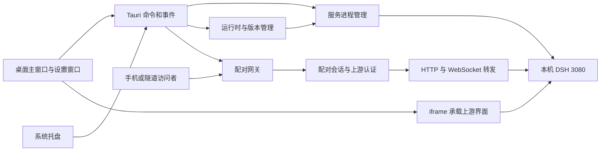

# DeepSeekHarness 项目深入审查

审查时间：2026-09-06。基线：`cc23285`（应用版本 `0.0.8`）。本文已根据后续修复 diff 更新核验状态。

## 变更核验（2026-09-06）

以下问题已在当前工作区 diff 中确认修复，并通过 Rust/前端检查：

- **L01** 服务退出 watcher 与 orphan 接管路径的 MutexGuard 重入死锁。
- **L02** 配对会话撤销未传播到已建立 WebSocket；停止、重新生成配对码、会话过期现在会触发连接取消。
- **L03** bundled 版本下载依赖系统 npm；下载流程改用 bundled Node/npm 工具链。
- **L06** 版本参数路径穿越、registry 未限制、下载并发互相清理、删除结果恒为成功等问题。
- **L07** 旧版本 token 判断的字符串前缀误匹配（如 `0.1.10`）。
- 配对码有效期、失败限流、重复 `pair` 参数、监听异常状态同步。
- 改写响应遇到非 identity 压缩编码时的内容损坏风险。
- 日志轮转对仍被 DSH 持有的 `service.log` inode 的破坏性问题。
- **X01、X02、X03** 重启失败恢复、手动版本强制刷新、默认服务面板历史日志加载。
- 构建脚本删除 runtime 后退回 `npm install` 导致不可复现的问题；现在会刷新 lockfile 后执行 `npm ci`。

当前验证结果：`cargo test` 96 passed、2 ignored；`cargo clippy --all-targets --locked --offline -- -D warnings`、`cargo fmt --check`、前端 lint 与 Prettier 检查均通过。未启动真实 DSH，2 个 ignored 用例需要真实 DSH。

本轮进一步确认并修复：版本启动前可用性校验与错误状态（L04 的前置校验部分）、网关最大并发连接数与请求头超时、同步上游认证交换阻塞 Tokio 的问题（改为受限 `spawn_blocking` + 超时）、设置更新的锁内事务，以及 telemetry 开关的惰性初始化/关闭短路。

本次批次继续完成：`dsh_switch_active_version` 版本切换事务（候选启动、运行状态等待、失败恢复、外部服务拒绝切换）；服务应用层 HTTP 健康探测；服务状态 `revision` 字段；发布产物完整性门禁；设置与服务状态的并发一致性补强。

本批次已进一步完成：PID 进程身份记录与跨平台命令行校验、长期日志容量治理、服务状态 revision 前端消费、Sentry 运行时关闭边界，以及发布产物完整性门禁；配对撤销和兼容性测试也已补齐。当前剩余的是发布环境验证项：真实 DSH 多版本升级/回滚、各平台进程身份差异和完整端到端故障演练，代码层面已无报告中列出的确定性缺陷。

## 1. 判断与范围

项目已经具备完整的桌面交付雏形。下一阶段最有价值的工作是提高“启动可信、切换可恢复、远程授权可撤销”的可靠性，再完善首次使用、诊断和操作反馈。

阅读范围包括 Rust 应用与配对代理模块、全部自有前端 HTML/JS/CSS、设置和版本模型、构建脚本、发布工作流、README、遥测文档，以及仓库现有截图。三个独立审查分支分别检查了服务与版本逻辑、配对网关、产品与交互，关键结论经过调用链交叉核对。

本次验证：

- `pnpm run lint`：通过。
- `pnpm run format:check`：通过。
- `cargo fmt --manifest-path src-tauri/Cargo.toml --check`：通过。
- `cargo clippy --manifest-path src-tauri/Cargo.toml --all-targets --locked --offline -- -D warnings`：通过。
- `cargo test --manifest-path src-tauri/Cargo.toml --locked --offline`：95 个通过，2 个依赖真实 DSH 的用例按原配置忽略。首次在沙箱内运行时，8 个本机监听测试被环境阻止；允许本机监听后全部通过。
- 隔离的 Rust 小程序验证了 MutexGuard 重入及 `if let` 临时锁的生命周期；隔离文件验证了重命名日志后已打开写句柄继续写入旧文件。
- 使用原始前端脚本配合 Node VM、假 DOM/IPC，复现了重启失败页面未恢复、设置首页未加载历史日志、手动刷新仍走 TTL 缓存三个问题。

没有启停用户的真实 DSH，没有执行发布或重新安装运行时，没有做 Windows/Linux 实机验证，也没有执行网络攻击或遥测发送实验。截图包含旧版本界面，仅作为视觉参考，功能判断以当前代码为准。产品建议尚未经用户访谈或使用数据验证。

优先级定义：P1 为应优先修复的正确性或信任边界问题；P2 为下一轮体验与维护性工作；P3 为适合在基础可靠后实施的扩展。不存在证据不足却标记为“已被远程利用”的结论。

## 2. 对当前产品和架构的理解

用户主要有三类：希望下载安装即用的普通用户；需要外部服务复用、版本固定和回退的开发者；希望手机或其他设备接入本机 DSH 的用户。

实际产品边界如下：

代码中已具备值得保留的基础：

- 静态前端无构建器，部署链路简单；Tauri/Rust 管理操作系统能力。
- `main.rs` 主要装配模块，配对逻辑已经拆成 token、HTTP、转发、隧道、上游认证等职责。
- 启停操作已有 lifecycle 锁，服务输出落盘，版本查询采用缓存后后台刷新。
- 配对身份使用随机 Cookie 会话，成功后轮换一次性码；代理自己的 Cookie 不转发给上游。
- CSP、窗口能力声明、DOM 文本写入约束、Node 下载哈希检查和多平台 CI 已存在。
- 遥测默认关闭，构建期 DSN 可选；日志展示会对启动令牌脱敏。

风险集中在这些模块之间的生命周期衔接。当前用多个布尔值、Mutex、后台线程和前端轮询拼接出整体状态，容易出现“配置已变但进程未变”“界面已停止但连接未停止”“端口可连但应用不可用”。

## 3. 产品优化

### P01｜围绕首次可用建立引导和诊断，而不是只提供启动按钮（P2）

当前主流程是自动探测端口、拉起服务、显示 iframe。plain 依赖系统工具，bundled 宣称开箱即用，但版本下载又依赖系统 npm（见 L03）。README 同时介绍架构、两种发行包、不同运行时版本，首次使用需要用户自己建立这些概念。

建议将普通用户默认入口明确为 bundled，将 plain 放到高级下载选项；首次启动展示“环境检查 → 启动服务 → 完成认证 → 页面可用”，失败时给原因和下一步：缺少工具、端口冲突、下载源不可达、权限不足、上游认证失败。保留技术日志作为展开内容。

验收以“干净机器完成首次使用”和“失败后用户能自行恢复”为主。可以记录本地阶段耗时和错误码；产品统计只在现有用户主动开启遥测的前提下采集。

证据：[服务探测](/Users/bingoogolapple/Desktop/dsh/bga-dsh-client/src-tauri/src/service.rs:125)、[启动页状态处理](/Users/bingoogolapple/Desktop/dsh/bga-dsh-client/ui/assets/splash.js:77)。

### P02｜把版本来源、版本选择和实际运行版本分开呈现（P1/P2）

用户关心的是“现在跑哪个版本、为什么、升级失败怎么回来”。当前“内置 / 已下载 / 使用中”混合了安装来源与运行状态，`settings.dsh_version` 又被当成真实运行版本。应分别展示：客户端版本、当前 DSH 运行版本、下次启动的目标版本、来源和兼容性。

建议默认显示经过验证的版本，预发布版本显式标记并允许筛选；提供上一个可用版本的恢复入口。兼容性信息先由维护者验证清单维护，不应凭 SemVer 大小推断支持程度。切换过程和回滚必须由后端保证，见 L04。

证据：[版本条目模型](/Users/bingoogolapple/Desktop/dsh/bga-dsh-client/src-tauri/src/dsh.rs:18)、[运行版本推定](/Users/bingoogolapple/Desktop/dsh/bga-dsh-client/src-tauri/src/version.rs:350)、[版本操作列](/Users/bingoogolapple/Desktop/dsh/bga-dsh-client/ui/assets/settings.js:458)。

### P03｜把跨设备接入做成可管理的授权流程（P1/P2）

目前有二维码、配对码、会话剩余时间和日志，但展示会话主要依赖 IP，隧道访问难以区分设备；“重新生成配对码”会清空全部会话，UI 没有提前解释这一结果。

建议分离“换一个新配对码”和“断开全部设备”，增加单会话撤销、配对时间、最近活动和可编辑设备名称。首次配对说明授权范围；会话接近到期时告知续期方式。设备名称和浏览器描述只作为用户识别信息，不能作为身份认证依据。

局域网地址在多网卡、VPN、网络切换下也应允许选择和刷新。隧道支持目前主要是手动反向代理接入，不能在 UI 上暗示已经自动创建隧道。先修复真实撤销能力（L02）再扩展控制项。

证据：[会话呈现](/Users/bingoogolapple/Desktop/dsh/bga-dsh-client/src-tauri/src/pairing/mod.rs:535)、[重新生成](/Users/bingoogolapple/Desktop/dsh/bga-dsh-client/ui/assets/settings.js:393)、[后端清空会话](/Users/bingoogolapple/Desktop/dsh/bga-dsh-client/src-tauri/src/pairing/mod.rs:563)。

### P04｜统一关闭、退出、停止的说明，并同步文档（P2）

README 写“退出时停止服务默认勾选”，当前 `Settings::default()` 实际为 false，设置页也说明默认保留服务。README 的机器 ID 描述为主机名与 MAC，代码实际使用环境变量中的主机名与用户名；Sentry 文档仍描述硬编码 DSN 和通过编译禁用，但代码已有编译期注入和 UI 开关。

建议首次关闭窗口时给一次非阻断提示“应用已收起，可从托盘恢复”；退出入口清楚说明本次是否保留服务。统一默认值、数据范围、配置路径和截图，避免用户按错误文档判断后台进程或隐私行为。安装页的签名/公证流程也值得完善，以降低首次启动障碍。

证据：[默认设置](/Users/bingoogolapple/Desktop/dsh/bga-dsh-client/src-tauri/src/settings.rs:14)、[设置页退出说明](/Users/bingoogolapple/Desktop/dsh/bga-dsh-client/ui/settings.html:128)、[Sentry 文档](/Users/bingoogolapple/Desktop/dsh/bga-dsh-client/docs/Sentry.md:12)、[实际机器 ID](/Users/bingoogolapple/Desktop/dsh/bga-dsh-client/src-tauri/src/telemetry.rs:224)。

### P05｜让用户能提交可用的诊断信息（P2）

当前能看日志，但环境、当前进程来源、下载状态、认证状态和兼容层命中情况分散。建议提供“复制诊断摘要”：客户端/DSH/Node 版本、OS/架构、服务来源、启动阶段、最近错误码、脱敏日志尾部。用户主动复制或导出，默认不自动上传。对会话令牌、配对码、路径和 npm 输出做明确脱敏。

成功标准是维护者不需要先追问多轮“哪个版本、哪种发行包、是不是外部服务、日志在哪”。

## 4. 交互与前端逻辑

### X01｜重启失败后仍保留断连旧页面（P1）

`service-restarting` 设置 `restartInProgress=true`；非 running 状态遇到这个标记会提前返回，只有再次 running 才清除。若重启进入 error，启动页、重试入口和错误日志都不能恢复，旧 iframe 继续显示。

已用原脚本模拟 `running → service-restarting → starting → error`：状态徽标为 error，但启动页仍隐藏、旧 iframe 仍显示，错误日志读取未触发。

建议仅在重启的中间阶段保留旧页面，并覆盖不可操作的“正在重启”提示；error、stopped、取消和超时都必须结束该状态。避免让已经失去连接的内容看起来仍可操作。

证据：[重启标记](/Users/bingoogolapple/Desktop/dsh/bga-dsh-client/ui/assets/splash.js:70)、[提前返回](/Users/bingoogolapple/Desktop/dsh/bga-dsh-client/ui/assets/splash.js:99)。

### X02｜手动刷新版本列表没有绕过缓存（P2）

刷新按钮调用 `dshSyncRemote()`，它调用 `dsh_maybe_refresh_remote_versions`，后端缓存一小时未过期时不会联网。已通过假 IPC 捕获确认调用。按钮在“任务已提交”后马上恢复，也不代表远程拉取完成。

建议自动进入页面走 TTL，手动刷新调用现有 `dsh_refresh_remote_versions`；按钮状态跟随请求完成事件，并显示最后成功刷新时间、所用源及失败原因。切换 registry 后应使旧源缓存失效或按源分别缓存。

证据：[刷新按钮](/Users/bingoogolapple/Desktop/dsh/bga-dsh-client/ui/assets/settings.js:643)、[远程刷新调用](/Users/bingoogolapple/Desktop/dsh/bga-dsh-client/ui/assets/settings.js:533)、[TTL 判定](/Users/bingoogolapple/Desktop/dsh/bga-dsh-client/src-tauri/src/dsh.rs:184)。

### X03｜默认设置首页没有初始化历史日志（P2）

服务面板在 HTML 中默认 active，但首次打开无 `?panel=` 的设置窗口不会调用 `switchPanel('service')`；历史日志的 `loadOnce` 恰好在该函数中。因此服务正在运行、已有日志时，用户仍可能看到“暂无日志”。原脚本模拟确认首开未调用 `read_service_log`。

建议所有进入路径统一经过面板激活生命周期：使用 URL 面板或默认 service，然后统一加载对应数据。

证据：[日志懒加载](/Users/bingoogolapple/Desktop/dsh/bga-dsh-client/ui/assets/settings.js:80)、[启动初始化](/Users/bingoogolapple/Desktop/dsh/bga-dsh-client/ui/assets/settings.js:690)、[默认 active](/Users/bingoogolapple/Desktop/dsh/bga-dsh-client/ui/settings.html:94)。

### X04｜日志适合持续观察，但不适合排查历史（P2）

设置页每条日志追加一个 DOM 节点，没有数量上限，同时强制滚动到底部。窗口关闭实际隐藏，生命周期较长；高日志量下节点和排版成本持续增加，用户向上查看时也会被新日志拉回。主启动页已有 300 行上限，可借鉴但应统一实现。

建议使用有界日志缓冲、分批渲染，仅在用户接近底部时跟随；增加暂停跟随、回到底部、搜索、复制与错误过滤。历史加载和实时追加采用序号/偏移，避免重复和覆盖。

证据：[日志追加](/Users/bingoogolapple/Desktop/dsh/bga-dsh-client/ui/assets/settings.js:269)、[主窗口限量](/Users/bingoogolapple/Desktop/dsh/bga-dsh-client/ui/assets/splash.js:129)、[关窗隐藏](/Users/bingoogolapple/Desktop/dsh/bga-dsh-client/src-tauri/src/main.rs:355)。

### X05｜耗时操作需要持久反馈和明确完成结果（P2）

下载最多允许 540 秒，但 UI 主要依赖短暂 toast 和“下载中”；切版等待固定 15 秒与后端启动时长没有统一协议。快速 IPC 返回容易被当成操作完成。删除目录即使失败也返回成功事件，见 L06。

建议操作统一具有任务 ID、阶段、开始时间、可取消性和最终结果；显示“正在下载 / 安装 / 校验 / 重启 / 已完成”，不制造无法准确计算的百分比。失败信息保留在面板内，允许复制和重试，toast 用于简短通知。

证据：[toast 生命周期](/Users/bingoogolapple/Desktop/dsh/bga-dsh-client/ui/assets/app.js:59)、[切版等待](/Users/bingoogolapple/Desktop/dsh/bga-dsh-client/ui/assets/settings.js:575)、[下载超时](/Users/bingoogolapple/Desktop/dsh/bga-dsh-client/src-tauri/src/dsh.rs:357)。

### X06｜补齐键盘操作与小屏适配（P2）

自定义确认框有 dialog/aria-modal，但缺少 Escape、焦点圈定和关闭后焦点归还，打开后默认聚焦确认按钮；对于删除操作，这不是稳妥的默认焦点。设置窗口固定 1080×760 且不可调整，较小可用桌面或较高缩放比例下应验证底部操作是否可达。

建议建立一套可复用对话框：关联标题描述、默认聚焦取消、Tab 圈定、Escape 取消、恢复触发按钮焦点；toast 用 aria-live。窗口尺寸按可用工作区约束、允许调整，内容区自然滚动。主题和原生平台窗口风格可后续改进，优先级低于流程可用性。

证据：[确认框](/Users/bingoogolapple/Desktop/dsh/bga-dsh-client/ui/assets/app.js:77)、[设置窗口尺寸](/Users/bingoogolapple/Desktop/dsh/bga-dsh-client/src-tauri/src/tray.rs:248)、[全局 overflow](/Users/bingoogolapple/Desktop/dsh/bga-dsh-client/ui/assets/app.css:32)。

## 5. 架构与工程化

### A01｜服务状态由一个管理器拥有，前端只渲染快照（P1/P2）

当前 lifecycle 锁已有价值，但 `child/orphan/starting/failed/detail` 分散存储，exit watcher、heartbeat、命令、退出钩子各自参与迁移；前端又维护重启标记、轮询和定时重载。L01 与 X01 是这种分散状态带来的具体后果。

建议保留当前 Tauri 与轻量前端，逐步形成单一服务管理器：串行接收 Start/Stop/Restart/Exit/ProbeResult；统一产出版本化的状态快照。采用 `Stopped / Starting / Ready / Stopping / Restarting / Failed`，外部服务和进程身份作为独立属性；携带 generation，丢弃旧进程/旧任务事件。

`info()` 应快速读取快照，不在持有状态锁时做端口连接、文件探测或命令调用；UI 与托盘共享同一套可用操作规则。停止、退出、重启统一接入管理器，并给任务提供结束与取消路径。

证据：[AppState](/Users/bingoogolapple/Desktop/dsh/bga-dsh-client/src-tauri/src/main.rs:51)、[ServiceManager 状态查询](/Users/bingoogolapple/Desktop/dsh/bga-dsh-client/src-tauri/src/service.rs:134)、[退出钩子](/Users/bingoogolapple/Desktop/dsh/bga-dsh-client/src-tauri/src/main.rs:423)。

### A02｜前端模块化和 IPC 契约比换框架更直接（P2）

自有前端不大，但 `settings.js` 同时负责导航、设置、日志、版本任务、更新和配对；共享函数经全局作用域隐式依赖，ESLint 需维护跨文件全局名单。建议拆成 service、versions、pairing、logs、dialogs 模块，先使用 ES modules、JSDoc 或轻量类型检查，明确命令参数和事件 payload。

公共异步任务协议可定义 `operation_id / phase / result / error_code / generation`。初始化采用“订阅事件 → 取快照 → 按 revision 合并”，避免事件丢失和旧请求覆盖新状态。隐藏窗口停止无必要轮询和渲染，恢复显示时重新取快照。

证据：[全局辅助函数](/Users/bingoogolapple/Desktop/dsh/bga-dsh-client/ui/assets/app.js:1)、[设置页](/Users/bingoogolapple/Desktop/dsh/bga-dsh-client/ui/assets/settings.js:1)。

### A03｜上游兼容层需要显式版本和契约测试（P1/P2）

代理改写 DSH 打包后的 JavaScript 中一段精确表达式，将其 loopback 判定替换为 true；HTML 又注入 polyfill。上游构建、插件路由或认证行为变化可能让局域网功能部分退化，应用本身却仍显示运行。

建议隔离 `DshAdapter`：描述支持的版本、认证方式、健康检查、连接 bundle 识别和改写规则。为实际支持的 DSH 版本保存可合法维护的最小测试 fixture，跑桌面认证、HTTP、WebSocket、设置持久化等契约测试。检测到不支持版本时显示兼容性状态和已知可用版本入口。优先寻求上游稳定配置/API，降低长期依赖打包字符串的成本。

证据：[精确表达式](/Users/bingoogolapple/Desktop/dsh/bga-dsh-client/src-tauri/src/pairing/rewrite.rs:127)、[未命中回退](/Users/bingoogolapple/Desktop/dsh/bga-dsh-client/src-tauri/src/pairing/rewrite.rs:195)。

### A04｜运行时重建会删除锁文件，构建并非始终可复现（P1）

仓库追踪 `src-tauri/resources/runtime/rt/package-lock.json`。`build-release.sh` 发现 runtime 不新鲜时删除整个 runtime 目录，再运行打包脚本；后者发现 lock 不存在便执行 `npm install`，而不是 `npm ci`。干净 CI 缓存未命中时就会走这条路径。

因此虽然 Node、DSH、pnpm 顶层版本固定，传递依赖仍可能随重建时间变化。打包脚本还按目录和文件名广泛裁剪运行时，目前构建流程未证明裁剪后的实际 DSH 功能可用。

建议把提交的 manifest/lock 放在独立受控输入目录，产物写 staging；重建只清产物，CI 强制 npm ci，版本与 lock 不一致立即失败。裁剪后执行隔离 HOME/端口下的运行时冒烟测试，最后写入成功 manifest。记录 lock 哈希、目标平台和架构。

证据：[删除 runtime](/Users/bingoogolapple/Desktop/dsh/bga-dsh-client/scripts/build-release.sh:73)、[install/ci 分支](/Users/bingoogolapple/Desktop/dsh/bga-dsh-client/scripts/bundle-runtime.mjs:107)、[裁剪逻辑](/Users/bingoogolapple/Desktop/dsh/bga-dsh-client/scripts/bundle-runtime.mjs:189)。

### A05｜把验证前移，并让所有产物就绪后统一发布（P2）

已有 Rust 测试、clippy、lint、format、cargo audit 和四平台矩阵，但唯一工作流由 tag 或手动触发，不覆盖日常 push/PR。每个平台在自己的 build job 完成后独立创建/更新公开 Release，缺少等待所有平台通过的汇总发布步骤；可能有平台失败但用户已收到新版本提示、对应安装包尚不存在。

建议拆为日常 verify、平台 build、统一 publish。各平台先上传构建 artifact，发布任务依赖全部成功，检查必需文件、生成校验清单，再一次公开；签名与公证作为实际发布能力逐步补齐。应用更新提示可进一步识别系统、架构及 bundled/plain，提供明确下载入口。

缓存还应覆盖真正构建输入：`runtime_fresh()` 比较版本和平台但没比较架构；CI runtime cache key 有脚本哈希但没有 runtime lockfile 哈希。相同平台跨架构重建或修改 lock 时，应确保不会误用旧产物。

证据：[工作流触发](/Users/bingoogolapple/Desktop/dsh/bga-dsh-client/.github/workflows/release.yml:10)、[每平台发布](/Users/bingoogolapple/Desktop/dsh/bga-dsh-client/.github/workflows/release.yml:215)、[运行时缓存 key](/Users/bingoogolapple/Desktop/dsh/bga-dsh-client/.github/workflows/release.yml:123)、[fresh 比较字段](/Users/bingoogolapple/Desktop/dsh/bga-dsh-client/scripts/build-release.sh:48)。

### A06｜测试应覆盖状态迁移和故障恢复（P1/P2）

95 个通过的测试说明现有纯函数、报文转换、模拟上游代理链路有基础保障，但不能覆盖本次确认的服务锁重入、前端恢复状态、完整版本切换、会话撤销和发布输入丢失。`dsh.rs` 当前也没有对应的内部单元测试模块。

建议新增有明确行为价值的测试：子进程正常/异常退出、孤儿接管、端口被其他程序占用、切版失败恢复、删除安装冲突、关闭网关后已有 HTTP/WS 连接被撤销、配对码过期/限流、重启失败恢复页、干净 bundled 环境下载版本。OS 进程行为用隔离的小子进程与临时目录验证；完整上游测试放在独立端口和 HOME 中。

对 `state::lock` 还要纠正文档中的前提：Mutex 中毒不保证业务状态保持一致，多字段更新中途 panic 可以留下部分修改。恢复锁可以是策略，但应验证不变量并记录诊断。`update_settings` 的 clone→save→write-back 结构对未来并发调用也不安全；当前调用点以同步命令为主，本文不把 lost update 标为已复现缺陷。

证据：[锁恢复说明与实现](/Users/bingoogolapple/Desktop/dsh/bga-dsh-client/src-tauri/src/state.rs:12)、[设置更新](/Users/bingoogolapple/Desktop/dsh/bga-dsh-client/src-tauri/src/state.rs:43)。

## 6. 代码逻辑与正确性

### L01｜服务退出观察线程持锁回调导致自锁（P1，已验证锁语义）

`spawn_exit_watcher` 持有 `sm.child` 的 MutexGuard，子进程退出分支调用 `sm.emit_status()`；该函数进入 `info()`，再次锁定 `child`。`guard.take()` 只清空 Option，不释放 guard。子进程正常退出或崩溃都可能触发，之后状态查询和启停也可能阻塞。

`start_inner` 的 `if let Some(pid) = *lock(&self.orphan)` 同样在分支内保留临时锁；存活分支的 `finish→info` 以及失活分支的再次加锁都可重入。它需要实际进入 orphan 分支，并非每次正常启动必现。

建议锁内只完成读写、生成后续动作；显式离开作用域后再落盘、发送事件和刷新托盘。加入退出和接管的限时回归测试。单纯更换锁实现会掩盖状态边界问题。

证据：[child 持锁分支](/Users/bingoogolapple/Desktop/dsh/bga-dsh-client/src-tauri/src/service.rs:434)、[info 重入](/Users/bingoogolapple/Desktop/dsh/bga-dsh-client/src-tauri/src/service.rs:139)、[orphan 分支](/Users/bingoogolapple/Desktop/dsh/bga-dsh-client/src-tauri/src/service.rs:242)。

### L02｜停止、重新生成和会话到期没有撤销已有长连接（P1，高置信代码路径）

`stop_pairing` 只改变 running、停止 accept、清空 sessions；已接受 HTTP 连接和升级后的 WS 运行于独立任务，双向拷贝没有停止或过期信号。会话有效期只在新 HTTP 请求鉴权时检查，已有 WS 不受影响。

此外 `handle_request` 不检查 running，停止时还保留配对码；停止后已存在的 HTTP keep-alive 连接仍可提交配对请求。这与界面“代理已停止 / 已清空会话”的承诺不一致。

建议网关和会话分别持有取消信号，所有 HTTP/WS 任务归入受管集合；停止等待任务结束，撤销/过期取消该会话下连接。请求鉴权检查 running 和 generation，避免旧网关任务在重启后继续处理。验收必须验证已建立的连接，而不能只验证新连接被拒绝。

证据：[停止实现](/Users/bingoogolapple/Desktop/dsh/bga-dsh-client/src-tauri/src/pairing/mod.rs:314)、[连接任务](/Users/bingoogolapple/Desktop/dsh/bga-dsh-client/src-tauri/src/pairing/mod.rs:375)、[WS 双向拷贝](/Users/bingoogolapple/Desktop/dsh/bga-dsh-client/src-tauri/src/pairing/tunnel.rs:170)。

### L03｜bundled 的版本下载仍依赖系统 npm（P1，确定缺陷）

应用启动会使用内置 Node，但 `do_download_dsh` 执行的是系统 shell 的 `npm install`，PATH 前缀没有选择 bundled npm。没有系统 Node/npm 的干净机器可以打开 bundled 默认版本，却无法使用版本下载。

建议建立统一 RuntimeResolver，返回 node、npm CLI、pnpm、DSH 入口及所需环境；bundled 下载直接使用内置 Node 执行内置 npm-cli.js。构建脚本已经有对应路径计算可复用。验收在移除系统 Node 的隔离 PATH 下进行。

证据：[下载命令](/Users/bingoogolapple/Desktop/dsh/bga-dsh-client/src-tauri/src/dsh.rs:297)、[构建期内置 npm 定位](/Users/bingoogolapple/Desktop/dsh/bga-dsh-client/scripts/bundle-runtime.mjs:114)。

### L04｜切换版本不是事务，失败后配置和界面可能先“切成功”（P1）

当前先保存选定版本，前端马上显示该版本，再调用异步重启；无新版本可执行性校验、无实际运行版本确认、无失败回滚。版本探测又把设置值用作 running。对于可验证归属的外部 DSH，客户端现在允许停止和重启并重新捕获启动令牌；无法确认归属的普通占端口程序仍保持不操作。

建议后端提供单一 `switch_version` 操作：检查已安装、确认进程归属、保存上一个可用版本、停止旧实例、启动新实例、确认健康与版本、提交配置；失败则恢复原运行版本或返回明确恢复动作。UI 只显示该操作的阶段和结果。删除保护要同时覆盖实际运行版本、待启动版本和正在安装版本。

证据：[设置命令](/Users/bingoogolapple/Desktop/dsh/bga-dsh-client/src-tauri/src/dsh.rs:432)、[前端先改显示](/Users/bingoogolapple/Desktop/dsh/bga-dsh-client/ui/assets/settings.js:568)、[running 推定](/Users/bingoogolapple/Desktop/dsh/bga-dsh-client/src-tauri/src/version.rs:350)。

### L05｜端口可连不足以证明服务健康或进程属于本应用（P1，条件性风险）

`is_up()` 仅 TCP connect；`info()` 看到 child 存在也可返回 running。其他应用占用 3080 时会被识别为可复用服务，DSH 卡住但进程存活时也缺少应用层健康判断。

启动时接管只检查“3080 有监听 + service.pid 中的 PID 存活”，不核对这个 PID 是否正是监听者、是否是原进程。PID 复用且端口被其他程序占用时存在错误归属风险，后续停止逻辑会对记录 PID 发信号。本文未在用户机器上制造这种情形。

建议探测 DSH 应用层身份、健康和认证能力；持久化进程启动时间、可执行路径、运行版本和实例标识，接管/停止前复验。不确定归属时只显示外部服务，不管理该进程。

证据：[TCP 探测](/Users/bingoogolapple/Desktop/dsh/bga-dsh-client/src-tauri/src/service.rs:125)、[接管判定](/Users/bingoogolapple/Desktop/dsh/bga-dsh-client/src-tauri/src/service.rs:609)、[结束目标进程](/Users/bingoogolapple/Desktop/dsh/bga-dsh-client/src-tauri/src/service.rs:1234)。

### L06｜版本文件操作缺少后端互斥、输入验证和真实失败结果（P1/P2）

版本字符串直接用于目录拼接和 shell 命令，registry 也直接插入命令；后端没有严格 SemVer/受支持 registry 校验和目录边界检查。当前正常 UI 主要提供已有版本/两个源选项，因此这不是已证实可由远程 iframe 任意调用的漏洞，但 IPC 层不能把前端下拉框当成完整约束。

下载前只检查 bin.js，再创建目录并启动后台线程，没有按版本的后端任务锁；前端 Set 只能约束当前页面。同一版本重复请求可能清理正在安装的目录。删除先检查选定版本，再异步删除，也没有与切版统一协调。`remove_dir_all` 的错误被忽略，仍发 `ok:true`。

建议输入先类型化，路径只能由规范化版本派生，尽量 `Command::args` 避免 shell 拼接；按版本串行执行 install/delete/use。安装到唯一临时目录，校验后原子提交。删除错误必须反馈；超时要终止实际进程树并回收输出任务。

证据：[目录创建与下载](/Users/bingoogolapple/Desktop/dsh/bga-dsh-client/src-tauri/src/dsh.rs:231)、[命令插值](/Users/bingoogolapple/Desktop/dsh/bga-dsh-client/src-tauri/src/dsh.rs:297)、[删除忽略错误](/Users/bingoogolapple/Desktop/dsh/bga-dsh-client/src-tauri/src/dsh.rs:406)、[registry 设置](/Users/bingoogolapple/Desktop/dsh/bga-dsh-client/src-tauri/src/dsh.rs:450)。

### L07｜六位配对码缺少尝试限制和独立有效期（P1，公网隧道开放前优先）

配对码使用加密随机源，但只有一百万种可能；代码没有配对码到期时间、失败次数或请求速率限制，且同一 query 可以携带多个 pair 参数，由 any 匹配。30 分钟是已配对会话的 TTL，不是码的 TTL。网络可达者因此有持续试码的机会，公网隧道使这一入口暴露范围更大。本次未进行枚举攻击。

建议短期失效、失败退避和全局限流，拒绝重复 pair 参数；二维码使用较长随机邀请令牌，保留六位码时限制人工输入尝试。隧道来源可能全部显示 loopback，不能只依赖 IP 限流。配对页面不要把仍有效的凭据写入普通诊断日志。

证据：[码空间](/Users/bingoogolapple/Desktop/dsh/bga-dsh-client/src-tauri/src/pairing/token.rs:13)、[多个 pair 参数匹配](/Users/bingoogolapple/Desktop/dsh/bga-dsh-client/src-tauri/src/pairing/rewrite.rs:60)、[配对签发](/Users/bingoogolapple/Desktop/dsh/bga-dsh-client/src-tauri/src/pairing/mod.rs:426)。

### L08｜遥测关闭只覆盖自定义上报，没有关闭已安装的 panic 通道（P1，特定构建与操作条件）

前提是构建注入有效 DSN，且用户曾启用遥测、Sentry 客户端已初始化。关闭开关只修改应用内 AtomicBool；自定义 capture_event/error 会检查它，但 Sentry 默认 panic 集成直接调用其 Hub 上报，绕过这两个包装函数。初始化配置没有 before_send 统一闸门，也未解绑客户端。已通过本机锁定的 sentry 0.34.0 / sentry-panic 源码核对路径，未实际发送遥测。

建议合并两处初始化代码，所有事件在统一发送边界检查用户授权；关闭后处理队列和客户端生命周期，使用内存 transport 测试“先开后关再 panic”。匿名标识建议用随机生成、可重置的安装 ID，避免把普通确定性哈希描述为绝对不可逆的匿名保障。

证据：[开关只改原子量](/Users/bingoogolapple/Desktop/dsh/bga-dsh-client/src-tauri/src/telemetry.rs:58)、[默认集成初始化](/Users/bingoogolapple/Desktop/dsh/bga-dsh-client/src-tauri/src/telemetry.rs:82)、[自定义事件短路](/Users/bingoogolapple/Desktop/dsh/bga-dsh-client/src-tauri/src/telemetry.rs:180)。

### L09｜日志轮转与“退出后保留服务”不兼容（P2，Unix 文件语义已验证）

轮转只在应用启动时检查 5MB。若退出时保留 DSH，下一次打开将 service.log 重命名为 .1，但仍运行的子进程 stdout 持有旧文件句柄，会继续写 .1；新 tailer 打开新的 service.log，读不到后续输出。长期不重启时也不会执行轮转，日志仍可持续增长。

建议根据保留后台服务的需求选择可控的日志归属：独立 supervisor/logger、能够重开日志的子进程协议，或有明确并发限制和数据丢失权衡的轮转方案。不能简单在后台继续 rename 同一正在写的文件。验收覆盖保留服务→超过阈值→重开应用→持续输出。

证据：[stdout 指向日志](/Users/bingoogolapple/Desktop/dsh/bga-dsh-client/src-tauri/src/service.rs:344)、[tailer 打开新路径](/Users/bingoogolapple/Desktop/dsh/bga-dsh-client/src-tauri/src/service.rs:677)、[启动时 rename](/Users/bingoogolapple/Desktop/dsh/bga-dsh-client/src-tauri/src/service.rs:755)。

### L10｜代理阻塞和连接生命周期缺少资源边界（P2）

HTTP async handler 内调用同步 `ensure_cookie`，其网络交换使用阻塞 TcpStream；冷启动时并发请求可能重复交换，拖慢运行时线程。每个连接独立 spawn，无统一连接上限和取消集合；accept 错误直接退出却未同步 running/error，可能出现“UI 运行中但监听任务已退出”。响应体缓冲有大小上限，这是已有保护，但总并发与完整响应等待仍需管理。

建议上游换票异步化或显式 spawn_blocking，按令牌 single-flight；设置整体 deadline、合理连接预算、请求头超时和任务回收。监听退出必须广播实际状态。不要简单给所有 WS 设置同一短空闲超时，应区分会话授权到期与正常长时间连接。

证据：[每连接任务与错误退出](/Users/bingoogolapple/Desktop/dsh/bga-dsh-client/src-tauri/src/pairing/mod.rs:375)、[请求内换票](/Users/bingoogolapple/Desktop/dsh/bga-dsh-client/src-tauri/src/pairing/mod.rs:452)、[同步交换](/Users/bingoogolapple/Desktop/dsh/bga-dsh-client/src-tauri/src/pairing/upstream.rs:94)、[缓冲读取](/Users/bingoogolapple/Desktop/dsh/bga-dsh-client/src-tauri/src/pairing/forward.rs:184)。

### L11｜旧版识别使用字符串前缀，误判更高补丁版本（P2，分类错误确定，版本影响条件性）

`starts_with("0.1.1")` 同时匹配 `0.1.10`、`0.1.100`。如果这些版本使用新认证协议，`dsh_launch_url` 却会直接跳过令牌获取，首次认证可能失败。此处不声称这些版本目前已经发布。

建议使用现有 semver 解析，并按确切协议引入版本或显式能力判断；补充边界版本、预发布版本和非法字符串测试。

证据：[旧版分类](/Users/bingoogolapple/Desktop/dsh/bga-dsh-client/src-tauri/src/service.rs:1010)、[跳过令牌路径](/Users/bingoogolapple/Desktop/dsh/bga-dsh-client/src-tauri/src/main.rs:202)。

## 7. 建议实施顺序与验收

| 批次 | 目标 | 工作 | 验收重点 |
|---|---|---|---|
| 第一批 | 消除失控状态 | L01 服务锁；L02 连接撤销；L07 配对保护；L08 遥测关闭；X01 重启失败恢复 | 子进程退出不阻塞；停止后已连接设备失去访问；关闭遥测后 panic 不入发送队列 |
| 第二批 | 让安装与版本变更可信 | L03 bundled 下载；L04 切版事务；L05 身份健康检查；L06 版本任务；A04 锁文件 | 干净环境可下载；失败恢复原版本；构建不改锁文件；重复操作不损坏安装 |
| 第三批 | 提高日常可用性 | X02/X03 刷新初始化；X04 日志；X05 任务反馈；L09 日志归属；P04 文档 | 刷新确实请求；初始日志可见；失败原因保留；长期日志有界 |
| 第四批 | 稳定演进和交付 | A01/A02 状态与模块；A03 兼容契约；A05 日常 CI/统一发布；X06 无障碍；P01/P03 引导 | 多平台回归；全部产物就绪才公开；键盘与小屏流程完成；首次配对能自行恢复 |

批次代表依赖和优先级，不是未经评估的人日承诺。第一批可先用小改动修复具体缺陷，再逐步提取管理器与契约。当前没有足够理由投入大规模框架迁移、重新实现上游 DSH 业务界面或堆叠新功能。
